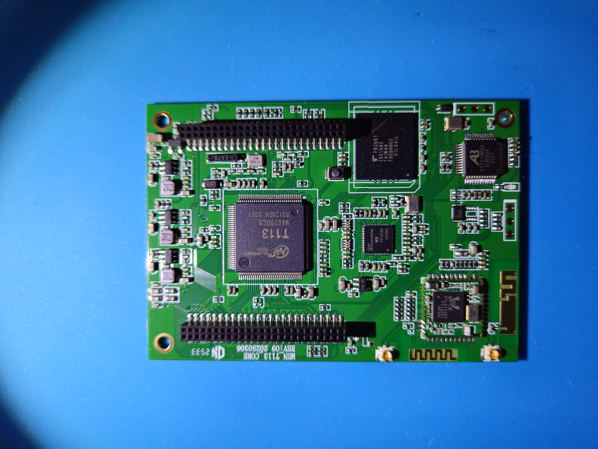
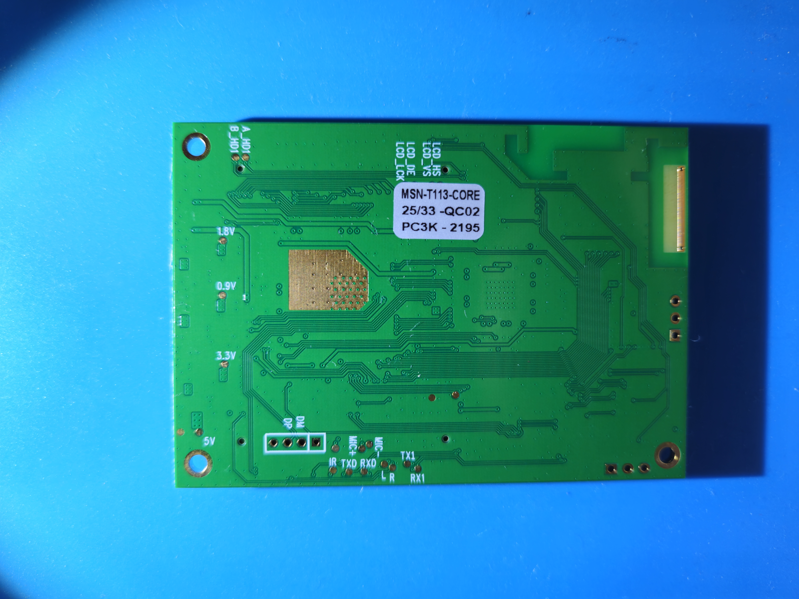
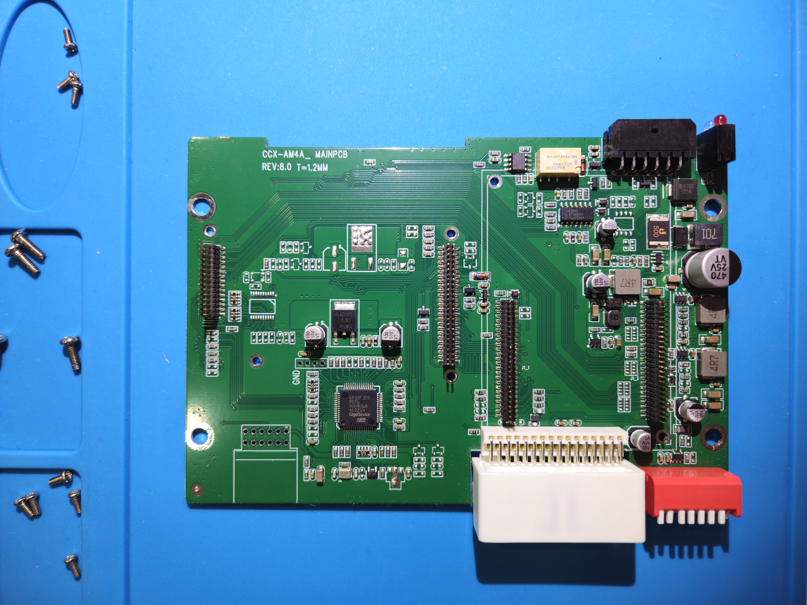
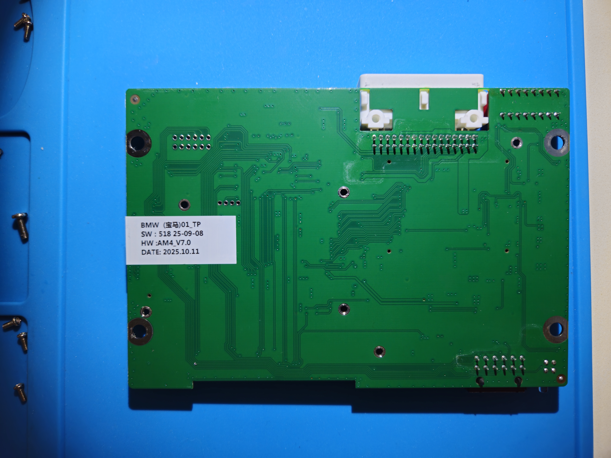
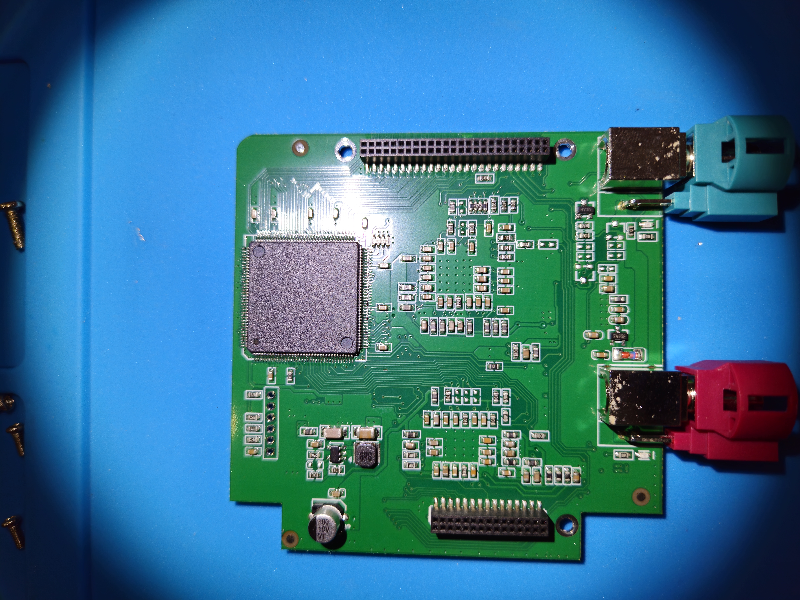
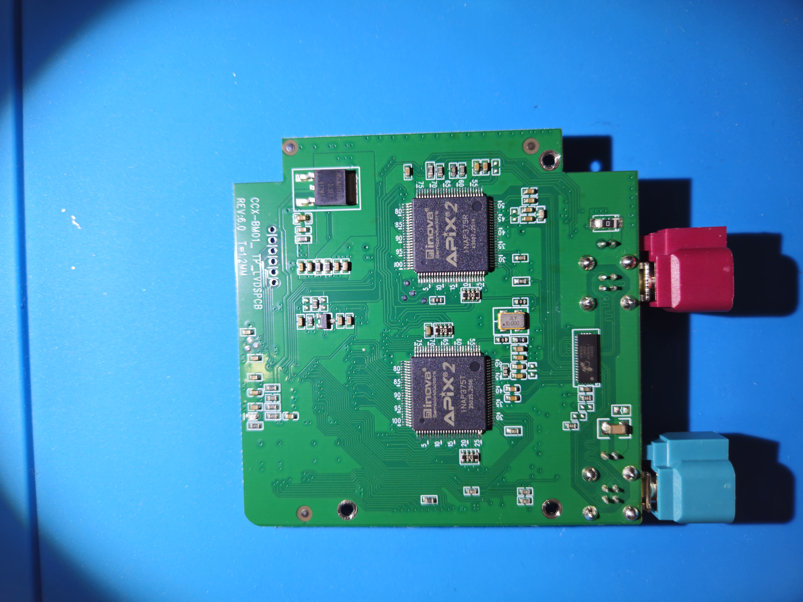
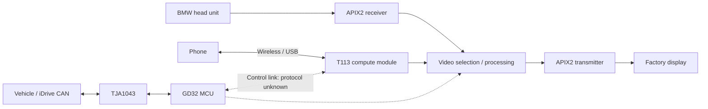

# T113 MMI — aftermarket BMW CarPlay / Android Auto interface

This teardown documents an aftermarket BMW infotainment interface built around an Allwinner T113 processor. Six photographs show both sides of three separate PCBs: a compute module, a vehicle-interface carrier board, and a display-interface board.

The notes below were compiled on September 6, 2026 from full-resolution photo inspection, the linked owner's account, and component documentation. Visible markings, manufacturer specifications, owner reports, and inferred functions are distinguished throughout. No powered measurements, continuity tracing, or firmware extraction were performed.

Original project: [MMI box reverse engineering and firmware customization discussion](https://www.reddit.com/r/CarHacking/comments/1vrb1w1/update_mmi_box_reverse_engineering_and/).

The owner identifies the device as an **ANYFAR-branded CarPlay / Android Auto retrofit box** installed between a BMW **NBT Evo head unit**, its display, and the iDrive CAN connection. They describe auxiliary-camera support and similarities with units sold under other brands. This is useful provenance, but does not establish firmware interchangeability with any particular Andream, Road Top, or Carlinkit product.

## Archive contents and provenance

| File | Contents |
| --- | --- |
| [20260815_140213_2.jpg](20260815_140213_2.jpg) | Display board: large unidentified IC, stacking sockets, two automotive display connectors |
| [20260815_140252_2.jpg](20260815_140252_2.jpg) | Display board opposite side: INOVA APIX2 transmitter and receiver |
| [20260815_140346_2.jpg](20260815_140346_2.jpg) | Main carrier: GigaDevice MCU, CAN transceiver, power circuitry, harness connectors |
| [20260815_140445_1.jpg](20260815_140445_1.jpg) | Carrier underside and product/version sticker |
| [20260815_140652_1.jpg](20260815_140652_1.jpg) | Compute module: T113, storage, wireless module, additional multimedia ICs |
| [20260815_140716_2.jpg](20260815_140716_2.jpg) | Compute module underside, labeled test points, inspection sticker |

All photographs are **8160 × 6120 pixels**, approximately 50 megapixels. EXIF identifies a **Samsung Galaxy S23** and capture times on **August 15, 2026, between 14:02 and 14:07**. These are camera metadata, not independently verified chronology. The photos total approximately **57.7 MB / 55 MiB**.

The six photos and original README were added together by `rusefillc` in commit `659c3be6db3fa626a5f1cc90a310314208d8e5eb`, **“t113 MMI naked”**, on September 6, 2026. The original README was a 92-byte Reddit URL with no embedded images; this document adds the findings and references all six photographs.

This directory contains no firmware dumps, schematics, source files, verified connector pinouts, or electrical measurements.

## Compute module



PCB silkscreen:

```text
MSN_T113_CORE
REV:03 20250306
```

Underside inspection sticker:

```text
MSN-T113-CORE
25/33 -QC02
PC3K -2195
```

`20250306` looks like a design date. The remaining sticker codes appear to be production or inspection identifiers, but their exact meaning is undocumented.

| Visible identification | Interpretation |
| --- | --- |
| **Allwinner T113** | Main application processor |
| **THGBMNG5D1LBAIL** marking on the large BGA | Corresponds to Toshiba 4 GB eMMC storage |
| **Realtek RTL8733BS** | Wireless connectivity chip on a small soldered module |
| **Nextchip N5** | Additional multimedia/video IC; exact specification unconfirmed |
| **AB-logo IC, `CTYC14B5A`** | Consistent with Bluetrum's encoded chip markings; exact model and role require further identification |

### Processor and memory

The **T113 family uses dual Arm Cortex-A7 cores** and provides hardware video decoding and multiple display interfaces. Allwinner lists Tina Linux as a supported software system. The photographed package and absence of a separate obvious DDR chip are consistent with a **T113-S3-style implementation with integrated memory**, but the visible top marking says only `T113`. **128 MB RAM is a strong hypothesis, not a measured specification**; the S3 datasheet specifies 128 MB integrated DDR3. Sources: [Allwinner T113 overview](https://www.allwinnertech.com/index.php?a=index&c=product&id=106&solveid=43), [Allwinner T113-S3 datasheet](https://linux-sunxi.org/images/7/73/T113-s3_datasheet_v1.6.pdf).

The storage marking corresponds to a **4 GB, eMMC 5.0, 153-ball BGA** device. This is a concrete firmware-extraction target. It is managed flash with an MMC interface; a conventional SPI flash programmer is not the appropriate direct interface. Actual identity and capacity could be corroborated by reading its identification registers. Source: [Toshiba THGBMNG5D1LBAIL datasheet](https://media.digikey.com/pdf/Data%20Sheets/Toshiba%20PDFs/THGBMNG5D1LBAIL.pdf).

### Wireless and multimedia

The RTL8733BS is used in **dual-band Wi-Fi / Bluetooth modules**, with SDIO for Wi-Fi and UART for Bluetooth. This supports the expected wireless phone-projection role. Another module vendor's exact Bluetooth version or antenna specifications should not be transferred to this board without confirming its module revision. Source: [Fn-Link RTL8733BS module documentation](https://www.fn-link.com/6233A-SRB-Wi-Fi-Module-pd46827459.html).

Two miniature coaxial antenna connectors and printed antenna structures are visible. Their individual assignments require tracing.

The **Nextchip N5** is plausibly associated with auxiliary-camera input. Nextchip produces analog HD video-interface devices, but no authoritative documentation was found mapping this exact `N5` marking to supported formats or resolutions. AHD/CVBS support at this particular chip remains a hypothesis. Background: [Nextchip video technology](https://www.nextchip.com/en/ahd/ahd.php?idx=5).

The separate AB-logo IC may provide additional Bluetooth/audio functions, but its role is not established. Bluetrum's encoded markings are discussed in the independent [bluetrum-tools reverse-engineering project](https://github.com/kagaimiq/bluetrum-tools); the marking alone is not a verified identification of its firmware or function here.

### Exposed test points



| Labels | Likely purpose and limitation |
| --- | --- |
| `TXD`, `RXD` | Serial signals; processor endpoint and console availability unknown |
| `TX1`, `RX1` | Another serial pair; numbering need not match the SoC's UART numbering |
| `DP`, `DM` beside a four-hole header | Strongly suggests USB D+/D−; host versus OTG connection unconfirmed |
| `5V`, `3.3V`, `0.9V`, `1.8V` | Power-rail measurement points |
| `MIC+`, `MIC-` | Microphone-related signals |
| `L`, `R` | Likely audio channels |
| `IR` | Likely infrared signal |
| `LCD_HS`, `LCD_VS`, `LCD_DE`, `LCD_CLK` | Display timing signals, consistent with a parallel display interface |

There are signs of soldering/probing around several pads, but the photographs do not establish a definite severed connection.

The owner reports trying the serial pads, receiving CAN-related debug output, and damaging a trace while removing wires, after which MMI-side controls stopped working. **That failure does not itself prove the pad carried physical CAN signaling.** It could have interrupted an MCU–SoC serial connection carrying decoded CAN events. Readable CAN-related UART logs are compatible with a serial control channel rather than CAN-H/CAN-L or the Linux console. Source: [owner's report](https://www.reddit.com/r/CarHacking/comments/1vrb1w1/update_mmi_box_reverse_engineering_and/).

## Main carrier and vehicle interface



PCB silkscreen:

```text
CCX-AM4A_MAINPCB
REV:8.0  T=1.2MM
```

The clearly readable MCU is **GD32F305RBT6**. GigaDevice specifies:

- Arm **Cortex-M4**, up to **120 MHz**.
- **128 KB internal flash** and **64 KB SRAM**.
- **LQFP64** package.
- Two **CAN 2.0B** controllers.
- Multiple UART/USART, SPI, and I²C interfaces.

These are chip capabilities; the photos do not establish clock settings or which peripherals the firmware uses. Source: [GigaDevice GD32F305RBT6 product page](https://www.gigadevice.com/product/mcu/mcus-product-selector/gd32f305rbt6).

A nearby NXP IC's marking reads as **TJA1043**, a high-speed CAN transceiver with standby and sleep modes. This is strong physical evidence of the vehicle CAN interface. Source: [NXP TJA1043 datasheet](https://www.nxp.com/docs/en/data-sheet/TJA1043.pdf).

The likely division of responsibility is:

- **GD32:** vehicle messages, button events, power-state handling, and control coordination.
- **T113:** phone projection, graphical interface, media, and higher-level application behavior.

This split is an architectural inference. The GD32 and T113 have separate execution environments and likely separate firmware images, so accessing the MCU would not automatically provide a Linux shell.

Other visible carrier features include several switching power supplies and linear regulators, a **470 µF / 25 V** capacitor, a small **NEC/TOKIN relay**, harness connectors, board-stacking headers, unpopulated component footprints, and an unpopulated four-hole header near the MCU with a `GND` label.

The relay could serve audio or another switched signal path; its function is not established by the photographs. Capacitor voltage ratings do not establish a safe bench-power pinout or input range. The four-hole header is not a verified SWD or UART pinout.



Product sticker:

```text
BMW (宝马)01_TP
SW: 518 25-09-08
HW: AM4_V7.0
DATE: 2025.10.11
```

The **V7.0 sticker versus revision 8.0 PCB** is a visible discrepancy. It may reflect different assembly and PCB revision schemes, or a reused label. Neither establishes the firmware currently installed.

## Display interface board



The large fine-pitch IC has **no readable identification**. Its position and extensive routing make video switching, processing, or programmable logic plausible functions. Identifying it as a particular FPGA, scaler, or MCU would exceed the available evidence.

The pink and turquoise connectors appear to be automotive HSD-style display connectors. Their colors alone are insufficient to assign input/output direction or pinout.



PCB silkscreen:

```text
CCX-BM01_TP_LVDSPCB
REV:6.0  T=1.2MM
```

Two devices are clearly identifiable:

- **INOVA INAP375R:** APIX2 receiver.
- **INOVA INAP375T:** APIX2 transmitter.

These devices support automotive serialized display links up to **3 Gbit/s**, with parallel RGB or OpenLDI/LVDS interfaces on their local sides. They also provide communication channels beyond the main video stream. These capabilities do not reveal the actual operating rate or screen resolution here. Sources: [INOVA INAP375R](https://inova-semiconductors.de/inap375r.html), [INOVA INAP375T](https://inova-semiconductors.de/inap375t.html).

The receiver/transmitter pair strongly supports an architecture that **receives the factory display stream and retransmits a selected output to the screen**.

## Inferred system architecture

The following is a functional interpretation, not a traced schematic. Video-selection circuitry and internal control connections remain inferred.



The modular construction would make it practical to reuse a compute module with different vehicle-specific carriers and display adapters. This is a design interpretation, not proof of compatibility across products.

## Reverse-engineering opportunities

1. **Map the labeled serial pairs to their endpoints.** Continuity measurements should establish whether they reach the T113, GD32, wireless circuitry, or an intervening device. Capture startup traffic after measuring logic levels.
2. **Identify the USB header's full pinout and destination.** USB enumeration could reveal an existing device interface. The photographs do not establish ADB support.
3. **Investigate Allwinner FEL availability.** `sunxi-fel` communicates with Allwinner's ROM USB recovery handler. Whether this board exposes the required USB port and a practical entry mechanism remains untested. Source: [sunxi-tools documentation](https://github.com/linux-sunxi/sunxi-tools).
4. **Locate the GD32 debug interface.** SWD would target the MCU's firmware and control logic; readout protection status is unknown.
5. **Obtain and inspect the correct vendor update package.** It may reveal component firmware, partition layout, application binaries, and update checks without requiring physical storage access.
6. **Read the eMMC if necessary.** Preserve the user area, accessible boot partitions, and configuration information. In-circuit access requires confirming voltage levels and preventing contention with the SoC.
7. **Identify the unmarked display IC.** This becomes particularly relevant for changing video switching or display behavior.

For button behavior or quick camera selection, the **GD32–T113 control connection** looks especially valuable: it is the likely point where vehicle inputs become application commands. For modifying the graphical interface, the **T113 firmware and eMMC contents** are the more direct targets.

## Unresolved questions

The available evidence does not establish:

- Exact T113 variant, installed RAM capacity, or operating clock.
- Running OS, kernel, bootloader, or application versions.
- Firmware partition layout, encryption, secure boot, or signature enforcement.
- Root credentials, an enabled console, ADB, or an available recovery path.
- MCU readout-protection state or the MCU–SoC control protocol.
- Connector pinouts, UART endpoints, or serial voltage levels.
- Actual APIX link rate, display resolution, or camera formats.
- Exact identity and function of the unmarked display IC, Nextchip N5, or AB-logo IC.
- Firmware compatibility with another branded MMI box.

The presence of Android Auto does not establish that the box itself runs Android. Further conclusions require electrical measurements, a firmware image, or runtime access.
